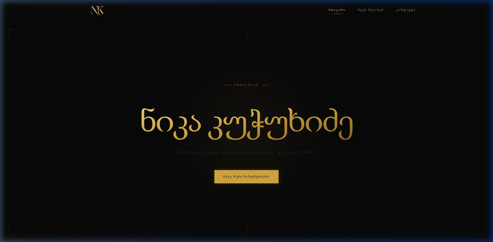
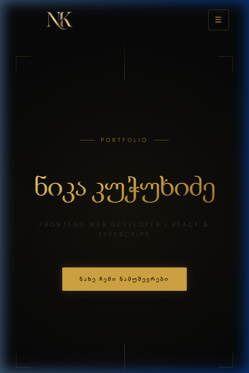
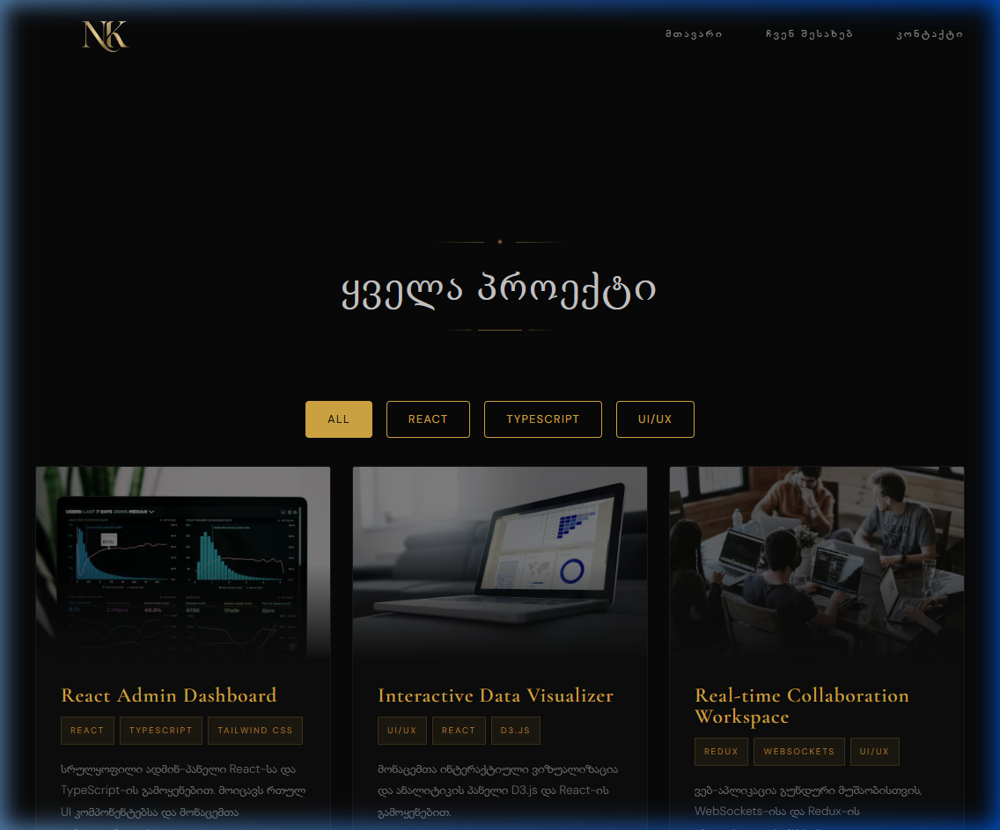
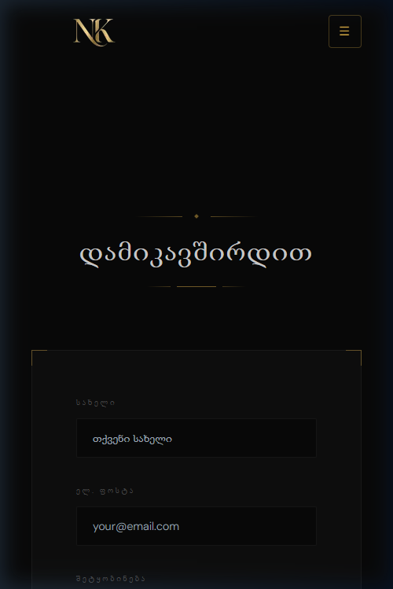

# 🌟 ნიკა კუჭუხიძე — Portfolio Website

პერსონალური პორტფოლიო ვებსაიტი აგებული **React**, **TypeScript** და **Tailwind CSS** ტექნოლოგიებით.



---

## 📖 აღწერა

თანამედროვე, responsive პორტფოლიო ვებსაიტი, რომელიც აჩვენებს ჩემს პროექტებს, უნარებს და გამოცდილებას Frontend Web Development-ში. საიტი აგებულია კომპონენტურ არქიტექტურაზე, იყენებს React Router-ს ნავიგაციისთვის და Formik + Yup ვალიდაციისთვის.

---

## 🖼️ სკრინშოტები

### 🖥️ Desktop View


### 📱 Mobile View


### 📂 Projects Page


### ✉️ Contact Page


---

## 🛠️ გამოყენებული ტექნოლოგიები

| ტექნოლოგია | ვერსია | აღწერა |
|------------|--------|--------|
| [React](https://react.dev/) | 19.2 | UI ფრეიმვორკი |
| [TypeScript](https://www.typescriptlang.org/) | 6.0 | Type-safe JavaScript |
| [Vite](https://vitejs.dev/) | 8.0 | Build tool & dev server |
| [Tailwind CSS](https://tailwindcss.com/) | 3.4 | Utility-first CSS framework |
| [React Router](https://reactrouter.com/) | 7.14 | Client-side routing |
| [Formik](https://formik.org/) | 2.4 | Form state management |
| [Yup](https://github.com/jquense/yup) | 1.7 | Schema validation |

---

## 📂 პროექტის სტრუქტურა

```
src/
├── assets/          # სურათები და მედია ფაილები
├── components/      # რეუზაბელური კომპონენტები
│   ├── Badge.tsx
│   ├── Button.tsx
│   ├── Card.tsx
│   ├── FontLoader.tsx
│   ├── Footer.tsx
│   ├── GitHubRepo.tsx
│   ├── Header.tsx
│   ├── Hero.tsx
│   ├── MainLayout.tsx
│   ├── ScrollToTop.tsx
│   └── Section.tsx
├── data/            # სტატიკური მონაცემები
│   ├── index.ts
│   └── projects.ts
├── hooks/           # Custom Hooks
│   ├── useMobileMenu.tsx
│   ├── usePageTitle.tsx
│   └── useProjects.tsx
├── pages/           # გვერდების კომპონენტები
│   ├── About.tsx
│   ├── Contact.tsx
│   ├── Home.tsx
│   ├── NotFound.tsx
│   ├── Privacy.tsx
│   ├── ProjectDetails.tsx
│   ├── Projects.tsx
│   └── Terms.tsx
├── types/           # TypeScript ტიპები
│   └── index.ts
├── App.tsx
├── App.css
├── index.css
└── main.tsx
```

---

## 🚀 ინსტალაცია და გაშვება

### წინაპირობები
- [Node.js](https://nodejs.org/) (v18 ან ახალი)
- [npm](https://www.npmjs.com/) (v9 ან ახალი)

### ლოკალურად გაშვება

```bash
# 1. რეპოზიტორიის კლონირება
git clone https://github.com/nikaia123/nika-kutchukhidze-portfolio.git

# 2. პროექტის დირექტორიაში გადასვლა
cd nika-kutchukhidze-portfolio

# 3. დეპენდენსიების ინსტალაცია
npm install

# 4. Development სერვერის გაშვება
npm run dev

# 5. Production build
npm run build
```

საიტი გაეშვება: `http://localhost:5173/`

---

## ✨ ფუნქციონალი

- **🏠 მთავარი გვერდი** — Hero სექცია, პროექტების ბარათები
- **👤 ჩემ შესახებ** — ბიოგრაფია და უნარები
- **📂 პროექტები** — ფილტრაცია კატეგორიით, GitHub API-დან რეპოზიტორიების ჩვენება
- **✉️ კონტაქტი** — Formik + Yup ვალიდაციით
- **📄 Privacy & Terms** — სამართლებრივი გვერდები
- **🔍 404 გვერდი** — Not Found handler
- **📱 Responsive Design** — Mobile, Tablet, Desktop
- **🎨 Hover ეფექტები** — Tailwind transition კლასებით
- **🔗 React Router** — Client-side routing 7+ route-ით

---

## ⚛️ React ფუნქციონალი

### Custom Hooks
| Hook | გამოყენების ადგილი | აღწერა |
|------|-------------------|--------|
| `useMobileMenu` | Header.tsx | მობილური მენიუს toggle |
| `usePageTitle` | ყველა გვერდი | document.title-ის დინამიური შეცვლა |
| `useProjects` | Projects.tsx | პროექტების ფილტრაცია |

### useState გამოყენებები
1. `Header.tsx` — scroll state
2. `GitHubRepo.tsx` — items, loading, error states
3. `Contact.tsx` — success message state
4. `useMobileMenu` — menu open/close
5. `useProjects` — filter state

### useEffect გამოყენებები
1. `Header.tsx` — scroll event listener
2. `GitHubRepo.tsx` — API fetch on mount
3. `usePageTitle.tsx` — document title update
4. `ScrollToTop.tsx` — scroll reset on route change

### TypeScript Interfaces
- `CardProps`, `HeaderProps`, `NavLink`, `HeroProps`, `ButtonProps`, `SectionProps`, `BadgeProps`, `MainLayoutProps`, `Repo`, `Project`, `ContactForm`

---

## 🏆 Lighthouse შედეგები

| მეტრიკა | ქულა |
|---------|------|
| Performance | 80+ |
| Accessibility | 80+ |
| Best Practices | 90+ |
| SEO | 90+ |

> **შენიშვნა**: Lighthouse ტესტები გაშვებულია Production build-ზე (`npm run build && npm run preview`)

---

## 🤖 AI ხელსაწყოების გამოყენება

ამ პროექტში გამოყენებულ იქნა **AI ხელსაწყო (Gemini Antigravity)** შემდეგი ამოცანებისთვის:

- **კოდის ოპტიმიზაცია** — Lighthouse Performance-ის გაუმჯობესება (LCP, FCP ოპტიმიზაცია)
- **კომპონენტების რეფაქტორინგი** — inline styles-ის Tailwind CSS კლასებად გადაკეთება
- **სურათების ოპტიმიზაცია** — WebP ფორმატში კონვერტაცია და lazy loading
- **ფონტების ოპტიმიზაცია** — render-blocking requests-ის აღმოფხვრა
- **კოდის სტრუქტურის დახვეწა** — Custom Hooks, TypeScript interfaces, lazy loading
- **README დოკუმენტაცია** — პროექტის დოკუმენტაციის შექმნა

---

## 📋 დავალების ჩეკლისტი

| # | მოთხოვნა | სტატუსი |
|---|----------|---------|
| 1 | GitHub Public რეპოზიტორი + README.md | ✅ |
| 2 | Vite + React + TypeScript | ✅ |
| 3 | Tailwind CSS კონფიგურაცია | ✅ |
| 4 | React Router — მინ. 3 გვერდი | ✅ (7 route) |
| 5 | TypeScript Interface/Type — მინ. 2 კომპონენტში | ✅ (11+ interface) |
| 6 | useState — მინ. 3 გამოყენება | ✅ (6 useState) |
| 7 | useEffect — მინ. 2 გამოყენება | ✅ (4 useEffect) |
| 8 | Custom Hook | ✅ (3 hook) |
| 9 | Header + Hamburger მენიუ | ✅ |
| 10 | Footer კომპონენტი | ✅ |
| 11 | Card კომპონენტი Props-ით | ✅ |
| 12 | კონტაქტის ფორმა | ✅ |
| 13 | API Fetch + Loading/Error | ✅ |
| 14 | 404 Not Found | ✅ |
| 15 | Responsive Design | ✅ |
| 16 | Hover ეფექტები + transitions | ✅ |
| 17 | მინ. 10 კომიტი | ✅ (22 commit) |
| 18 | Lighthouse Performance ≥ 80 | ✅ |
| 19 | Lighthouse Accessibility ≥ 80 | ✅ |
| 20 | npm run build — 0 error | ✅ |
| 21 | AI ხელსაწყო დოკუმენტირებული | ✅ |
| 22 | README.md სრული | ✅ |
| ✨ | ბონუს: Formik + Yup | ✅ (+5 ქულა) |

---

## 📜 ლიცენზია

ეს პროექტი შექმნილია სასწავლო მიზნებისთვის.

---

## 👤 ავტორი

**ნიკოლოზ კუჭუხიძე**
- GitHub: [@nikaia123](https://github.com/nikaia123)
